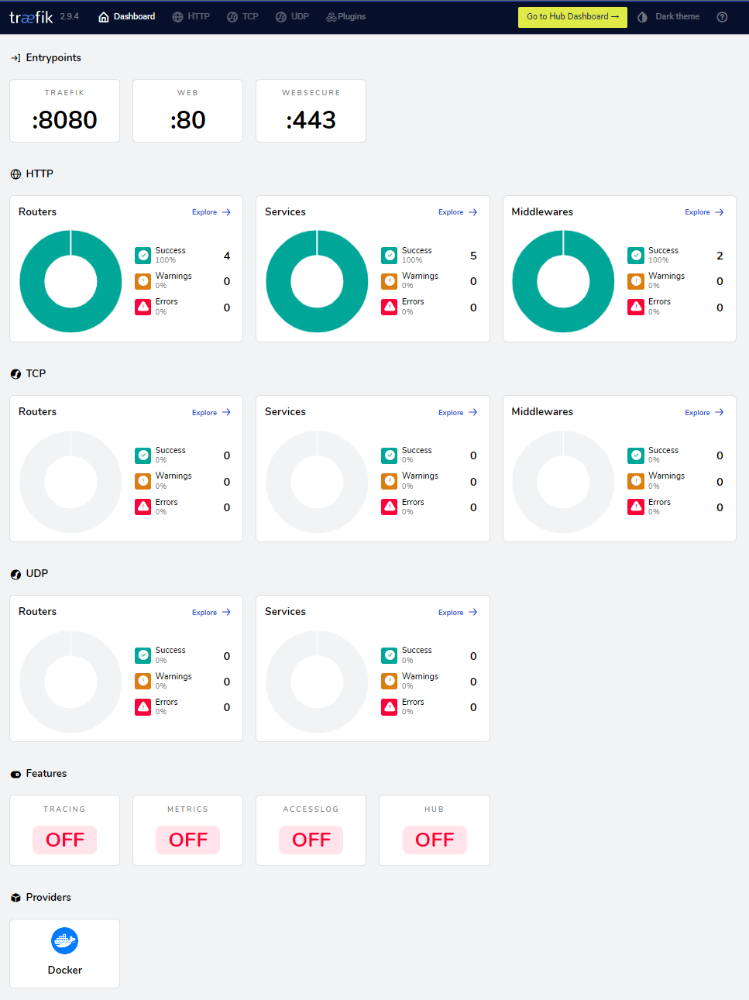
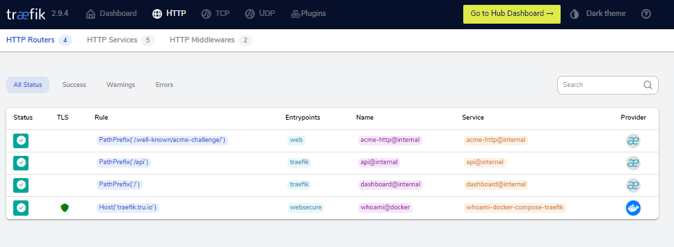

# Docker compose traefik
> Docker compose and configuration to setup traefik ingress for web traffic

[![LICENSE][license-image]][license-url]

This docker-compose.yml uses [traefik](https://traefik.io/) - "The Cloud Native Edge Router".

> Traefik is a reverse proxy / load balancer that's easy, dynamic, automatic, fast, full-featured, open source, production proven, provides metrics, and integrates with every major cluster technologies... No wonder it's so popular!

The configuration bases on docs that can be found on the traefik project website - [Docker-compose with let's encrypt : HTTP Challenge](https://doc.traefik.io/traefik/user-guides/docker-compose/acme-http/)

## Main functions
* Use Traefik as a layer-7 load balancer
* SSL termination for a set of micro-services and/or web apps
* Automatic discovery of any services on the Docker host
* Traefik reconfigure itself automatically when containers get created (or shut down)
* HTTP traffic can be routed accordingly based on automatic reconfiguration
* Let's Encrypt to automatically generate and renew SSL certificates per hostname



## Setup

* Server with public IP
* Install latest Docker (i.e. [Get Docker CE for Ubuntu](https://docs.docker.com/install/linux/docker-ce/ubuntu/))
  - [Post-installation steps for Linux](https://docs.docker.com/install/linux/linux-postinstall/)
* Install latest [Docker Compose](https://docs.docker.com/compose/install/#install-compose)
* Configure your domain to point to your IP, i.e. `my-test-domain.com`
  - use also wildcard `CNAME` `*` is an alias `my-test-domain.com`

## Usage example

Now create directory for traefik:
```sh
cd ~
mkdir sites
cd sites
git clone https://github.com/bitroniq/docker-compose-traefik.git
cd docker-compose-traefik
```

The `docker-compose.yml` provides simple way to create immutable Traefik container.

All configration is provided inside `docker-compose.yml`

Mounting the `/var/run/docker.sock` Docker socket in the container allows Traefik to listen to Docker events and reconfigure its own internal configuration when containers are created (or shut down).

## Customize the docker-compose.yml

1. Replace postmaster@example.com by your own email within the `certificatesresolvers.myresolver.acme.email` command line argument of the traefik service.
2. Replace `whoami.example.com` by your own domain within the `traefik.http.routers.whoami.rule` label of the whoami service.
3. Optionally uncomment the following lines if you want to test/debug:
   - `#- "--log.level=DEBUG"`
   - `#- "--certificatesresolvers.myresolver.acme.caserver=https://acme-staging-v02.api.letsencrypt.org/directory"`

## Running traefik

To boot the container from the `~/sites/docker-compose-traefik` directory, run:
```sh
docker-compose up -d
```
Now you can open your browser and go to `http://localhost:8080` to see the Traefik Dashboard.


## Checking the logs

```
root@ubuntu-s-1vcpu-1gb-amd-fra1-01:~/docker-compose-traefik# docker-compose logs -f
Attaching to simple-service, traefik
simple-service | 2022/11/15 12:26:52 Starting up on port 80
traefik    | time="2022-11-15T12:26:52Z" level=info msg="Configuration loaded from flags."
```

## Dashboard Screenshots




## Final verification


## Web apps and websites reconfiguration to expose via Traefik

The only things that must be changed in typical `docker-compose.yml` are:
* to remove the ports exposing definitions (Traefik will expose what is needed automatically)
* add traefik labels - Traefik needs to know which Layer 7 `Host` must be used for routing traffic

Example - Simple apache `docker-compose.yml`:

```yml
version: '2'

services:
  apache:
    image: 'bitnami/apache:latest'
    labels:
      - "traefik.enabled=true"
      - "traefik.frontend.rule=Host:fileserver.my-test-domain.com"
    volumes:
      - ./html:/app
    restart: always
```

## Release History

### [Unreleased]

### [v2.0] - 2022-11-15
#### Updated
- Updated Screenshots
- Updated docker-compose
- Upgrade to Traefik 2.9

### [v1.1] - 2018-07-17
#### Fixed
- Fixed some typos

#### Added
- Something

### [v1.0] - 2018-07-17
#### Fixed
- Some typos

[Unreleased]: https://github.com/bitroniq/docker-compose-traefik/compare/v2.0...HEAD
[v2.0]: https://github.com/bitroniq/docker-compose-traefik/compare/v1.1...v2.0
[v1.1]: https://github.com/bitroniq/docker-compose-traefik/compare/v1.0...v1.1
[v1.0]: https://github.com/bitroniq/docker-compose-traefik/compare/ff494e6...v1.0

---

## Meta

Piotr Kowalski – [@YourTwitter](https://twitter.com/YourLoign) – YourEmail@example.com

Distributed under the GNU GPL license. See ``LICENSE`` for more information.

[https://github.com/bitroniq/docker-compose-traefik](https://github.com/bitroniq/docker-compose-traefik)

## Contributing

1. Fork it (<https://github.com/bitroniq/docker-compose-traefik/fork>)
2. Create your feature branch (`git checkout -b feature/fooBar`)
3. Commit your changes (`git commit -am 'Add some fooBar'`)
4. Push to the branch (`git push origin feature/fooBar`)
5. Create a new Pull Request

<!-- Markdown link & img dfn's -->
[license-image]: https://img.shields.io/badge/license-GPL-brightgreen.svg
[license-url]: https://raw.githubusercontent.com/bitroniq/docker-compose-traefik/master/LICENSE
[wiki]: https://github.com/bitroniq/docker-compose-traefik/wiki

